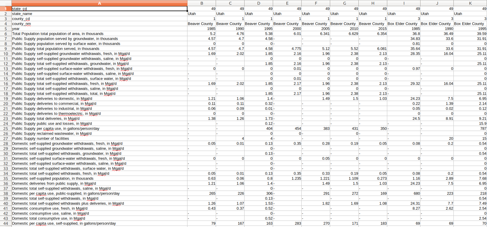
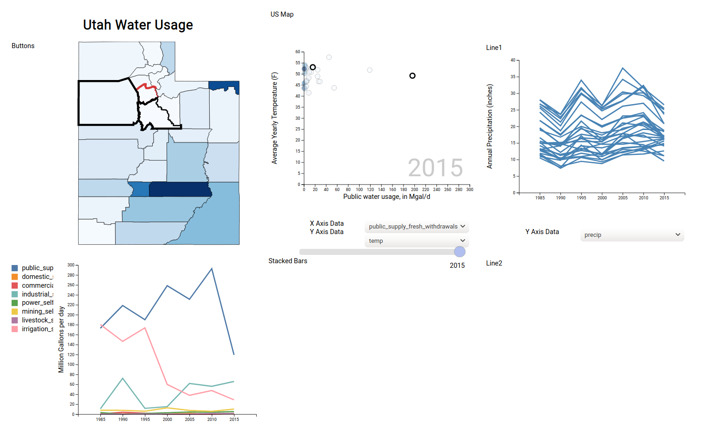
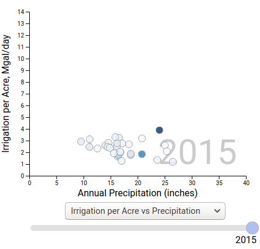
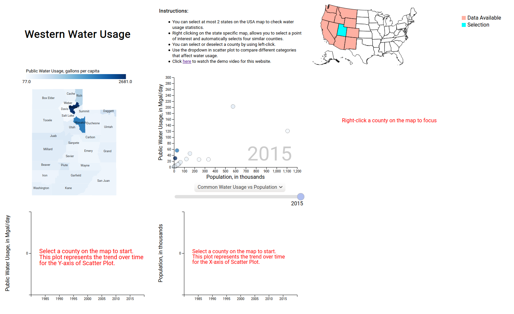
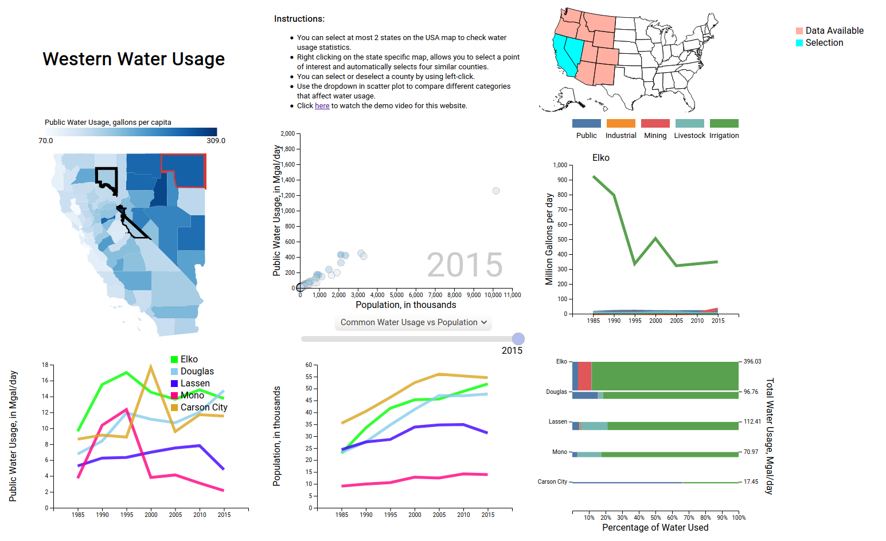
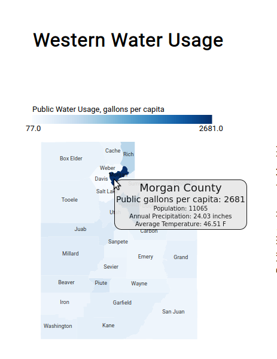

# Project ProcessBook

**Github:** https://github.com/fmitch/dataviscourse-pr-western-water-use

**Github Pages (Hosted):** https://fmitch.github.io/dataviscourse-pr-western-water-use/

## Overview and Motivation
The purpose of this project is to effectively display data on water usage in the Utah and other areas of the Western United States. Temperature, precipitation, and water usage data is available for each county over time, providing perspective for past water usage and how usage has been affected by other factors. 

There is publicly available data on water usage for each state from the USGS. However this data is an overwhelming amount of information with no visual statistics or tools for interpretation. This data is difficult for the public to read and interpret, since there are many complex factors such as different categories of water use, as well as different water needs in different climates. Visualizing water consumption against other variables can provide us insights into an area's condition. In addition, the USGS data does not provide any context or information about reckless water use in some of the nations driest areas.

Water is an essential resource that needs to be analyzed by not just the government but also by community members. Knowing how much water is consumed every year in one area and comparing it with other data such as precipitation, population, and agricultural or industrial output can help devise a solution to various water usage problems. For example, comparing water usage with temperature can help us know how global warming affects per capita water consumption. By knowing and understanding the data carefully, we can allocate resources and change policy to prevent a water crisis. Therefore, this project's motivation is to spread information in a visual form that is readable and understandable by the general public.

We also provide tools to compare many different variables, finding communities that are outlines in terms of water usage and climate. Our visualization will help users find if a county is particularly conservative in their water usage, possibly encouraging research into what methods this county uses to encourage responsible water usage. This visualization can be used to compare water usage between counties with similar climate and populations.

Although we do not have a background in water conservation, this project was prompted by concerns about irresponsible water use along the Wasatch Front as well as other areas in Utah. Utah is the 2nd driest state in the US, but desert communities such as St. George use far more water per capita than other desert metro-areas such as Las Vegas and Tucson. As well, rampant water use along the Wasatch Front is entirely responsible for the rapidly lowering water levels in the Great Salt Lake, which would be catastrophic for air quality, wildlife, and local businesses.

## Related Work
There are several governmental organizations that provide data and high level visualizations into how water is used across the United States, but to our knowledge there is no fine-grain data visualization available to the public. Some of these data and visualization sources are as follows:

**USGS Water Use Data for Utah:** https://waterdata.usgs.gov/ut/nwis/water_use?
As we can see, USGS has a website which displays data for water consumption, but the data is represented using tables with hundreds of columns. This is difficult to read and understand. Hence, a better approach is required which visualizes the same data in a way which is easy to read and interpret.

**USGS Water Use Data:** https://labs.waterdata.usgs.gov/visualizations/water-use/index.html
This page provides water usage data for the United States but fails to provide details for each state. Additionally, it fails to provide a side-by-side comparison of different categories.

**US EPA:** https://www.epa.gov/watersense/how-we-use-water
US EPA just displays an article with a few visuals for a given year. There is no historical data displayed. It does not provide the trend over time for water usage.

## Project Objectives
This visualization is intended to present data about water consumption so that the user can observe trends in water usage, and potentially find ways that local communities could improve. With this project, we are specifically trying to answer the following questions for any user:

* How much water is consumed by a state or its counties?
* How does a state/county compare to others in terms of water usage?
* How does water usage vary as per the temperature and precipitation?
* What categories of water usage consume the most fresh water?
* Which category of usage must be reduced to protect water resources?
* How to plan on saving water?
* Which areas to target for saving water?
* Which county/state has unused abundant resources that can help others?

Other objectives include:

* Learning about maps in visualization.
* Learning and understanding interactive and synchronized layout.
* Building and hosting a website on github.
* Learning and developing various types of visualization charts.

## Data and Processing
The main data for our project comes from the USGS survey of water usage (https://waterdata.usgs.gov/ut/nwis/water_use/). This data is available for every county in the continental US every 5 years. In particular, the data for western states is available for 1985-2015.

However, this data has considerable problems in terms of consistency. Over 250 different data categories are defined for each county, but only a small fraction of these contain data. Over time, the reporting system for counties changed and measurements that were reported in one category were changed into another. We had to manually determine which categories to combine, which data was not available for each county, and which of the categories were relevant for our visualization.

Country precipitation and temperature data is available for every county in the continental US at ftp://ftp.ncdc.noaa.gov/pub/data/cirs/climdiv/. This data requires aggregation and processing to match the timeline of the water-use data. US County GEOJson data is available here: https://eric.clst.org/tech/usgeojson/

## Exploratory Data Analysis and Cleanup:
Initially, we used the USGS tabular visualization to explore our Data. This helped us to search for various categories and check availability of data for counties. 

We were able to draw a few insights such as total water consumption and it's different categories. This was sufficient to start working on creating designs for visuals. Based on availability of data in each category, we filtered the data and then designed visuals accordingly.

Due to the complex nature of the data, preliminary visualization of results was very difficult. With over 250 categories of water usage provided in the USGS data, we had to combine many different categories in order to provide meaningful insights. As well, some of the useful usage categories had data for some years, but not for others. The reporting requirements for several categories changed over time, meaning that we had to manually parse the categories to determine which ones could be reasonably combined. 

 
 USGS Tabular Data. Note how many of the row-categories are incomplete for most years.

As the design evolved we used different visualizations to highlight important data rather than allowing the user to arbitrarily select any of the many variables included in the data. This resulted in a cleaner, more understandable user experience, and we provide specific details of this evolution below.

## Design Evolution

At the start of our proposal, we had the following planned: A home page would display a map of the western US, and from there you would be able to select a state to provide a more detailed view, shown below. This detailed view would have 3 main components: 
* Main view:
  * A map and scatterplot with dropdown menus to select the $x$ and $y$ axis variables
  * Counties in the map and scatterplot would be colored by the $y/x$ value of each point
  * A slider could be used to select different years
* Point-of-Interest View
  * A single county could be highlighted to show water usage broken into several categories, with a bar chart comparing different counties, and a line chart showing the change in water categories over time
* Time View
  * Line charts showing the $x$ and $y$ variables from the scatterplot dropdowns, as they change over time.

 
 Initial design concept 

As we worked on our first draft of this design, we found we needed to discard several of our design elements. For example, we thought a table of buttons was useful since there could many counties that the user wouldn't be able to find on the map. However, we realized the buttons were unnecessary if we simply labeled each county on the map, since selection could be easily made there. We also saw that a map of the US would not be necessary if viewing a single state.

We produced an initial draft of this design, with just data from Utah available:

 
 Milestone Visualization. Note the fully customizable x and y axis, as well as the cluttered line charts.

#### Improving User Experience

After some feedback from the peer review session and our milestone meeting with the TA, we made some major adjustments. With so many water categories,
the line chart on the bottom row was quickly becoming unreadable. As well, the number of lines in the longitudinal chart on the right was infeasible, even if we were to highlight the selected counties. A general issue was that each view had many complex parts which were difficult for a user to understand. Instead of providing a highly customizable visualization, instead make a simple visualization with a few interesting options.

A major shift in the project occurred as we removed some of the extensive customization available to the user and replaced the options with simpler selections that would be more straightforward for a new user. We combined some of the water categories, and changed the line chart to only show the currently selected counties (up to 5). We removed the ability for the user to select any variable for the $x$ and $y$ axes and changed to a single dropdown with a few preset variables to compare:
* Public Water Usage vs. Population
* Total Water Usage vs. Population
* Total Water Usage vs. Annual Temperature 
* Irrigation per acre vs. Annual Temperature
* Irrigation per acre vs. Annual Precipitation 

These categories were selected because they could potentially highlight counties that have unusual behavior in terms of water usage and irrigation. For example, this showed that although Morgan and Summit counties have similar precipitation, Morgan County irrigates at more than double the rate of Summit County.

 
Irrigation per acre of Morgan (dark blue) and Wasatch (medium blue) counties. Despite similar precipitation and climate, Morgan County uses over twice the water for irrigation per acre.

Rather than basing the color of the counties on the variables of the scatterplot, we opted to have a single color scale which is consistent with different display selections, in order to prevent confusion by colors changing.

We also included an auto-select feature. This is probably the most useful feature we added, which was based on feedback during the peer review. By auto-selecting counties that are most similar based on population and climate, users can compare relevant counties quickly.

### Visualization Aspects
Here we highlight some of the different aspects of our final visualization.

##### US Map
We decided not to include a landing page with a US map, and reincorporated our early design idea of a small US map in the top corner. This actually allows the user to select multiple states (in the Western US). On the initial loading, Utah is selected by default, and no counties are selected.

 
Initial view of the visualization on load. The line charts and focus view do not show data until a county is selected.

##### Focus View
A county can be focus-selected by a right-click, which runs auto-selection on the focus county as well as opening the focus view charts in the right column. 

The auto-selection finds the four most similar counties to the selection using the following (completely arbitrary) distance metric:
$$D(a,b) = \sqrt{ (\frac{a_{pop} - b_{pop}}{100,000})^2 + (a_{precip} - b_{precip})^2 +  (a_{temp} - b_{temp})^2 } $$
The difference between the hottest and coolest counties in Utah was around 10 degrees F, and the difference in precipitation was also about 10 inches. The variation in population was much greater, from 2,000 to 1.1 million. This means that each unit included in the metric (population, precipitation, and temperature) is weighted equally (roughly). On the map and scatterplot, the focus county is shown with a thick red border and a black border for the other selected counties.

The focus view charts are:
* A line chart showing water usage in categories, changing over time.
* A relative bar chart showing water usage in different categories. Rather than just showing water usage as a percentage, we also used the height of the bar chart to indicate the actual volume of water used. This value is also indicated on the right side as a label. The bar chart also includes a tooltip showing the actual water usage in each category.

 
Focus view. The tooltip shows the specific category values, and the height of each bar shows the relative county usage.

##### Multi-state Selection

Last of all, we added multi-state selection to the US map in the top corner. Since this selection could cover a large area, the text labels on the map were removed, but auto-selection applies to counties from both states, allowing for some interesting comparisons such as the St. George, Tucson, and Las Vegas metro areas, which are similar in climate but very different in terms of water usage.

 
Multiple states can be selected on the US map to compare counties in the different states.

## Evaluation:

All in all, this visualization was successful. Users are able to explore the specific water usage of different counties, as well as comparing similar counties and specifically selected ones. Trends in usage over time are shown in both the line-plots on the bottom and the focus view column on the left. Tooltips provide specific details for each county, and interactive selection is available in both the map and scatterplot.

One problem that was realized as we completed the visualization is that due to the complexity of the data, it seems that some counties may have errors in the existing data. For example, in 2015 Morgan County is reported as using 2,681 gallons of public, commercial, or domestic water per day. This is almost 10 times the usage of similar nearby counties, and in other years their usage is similar to nearby Weber and Davis Counties. This leads us to believe that the water usage data provided by USGS either contains errors or else is lacking much of the context required to understand what these numbers mean. 

 
Morgan County has unrealistic data for gallons per capita usage.

#### Possible Improvements
Water usage is a complicated problem in the western US, with lots of passionate arguments for increasing or decreasing water use, and billions of dollars going towards pipeline projects. Our visualization fails to communicate much of this nuance. For example, if a climate in southern Utah is much warmer and drier, than to maintain the same standard of living as in northern Utah, more water would be required. There may be a point at which the higher water consumption is unsustainable, but this visualization does not provide any info about this.

There are a number of ways this visualization could be improved. For example, we could include presets to highlight counties that have unusual water usage or that provide insight into why some counties should or should not have higher usage than others. Highlighting similar metro areas or deserted areas and showing details about how these counties are similar or different could provide a lot of context missing in the current visualization.

We considered using the size of points in the scatterplot as another channel of communication, but decided against it mostly due to trying to simplify the user experience. It's possible that using this visual channel would provide a better experience to the user. This same idea applies to our use of color throughout the process; there may have been a better way to utilize colors.

With so many different views, a user could become easily overwhelmed. We intended this visualization to be geared more towards users looking to specifically compare counties and discover trends in the data, rather than users who are interested in learning generally about water usage. The complexity of our views may be difficult for many users to interpret. 

Ultimately, with any visual project there are layers of polish that can be added and tweaks that can be made, but we are satisfied that our current visualization meets our initial objectives and provides an efficient user experience.
