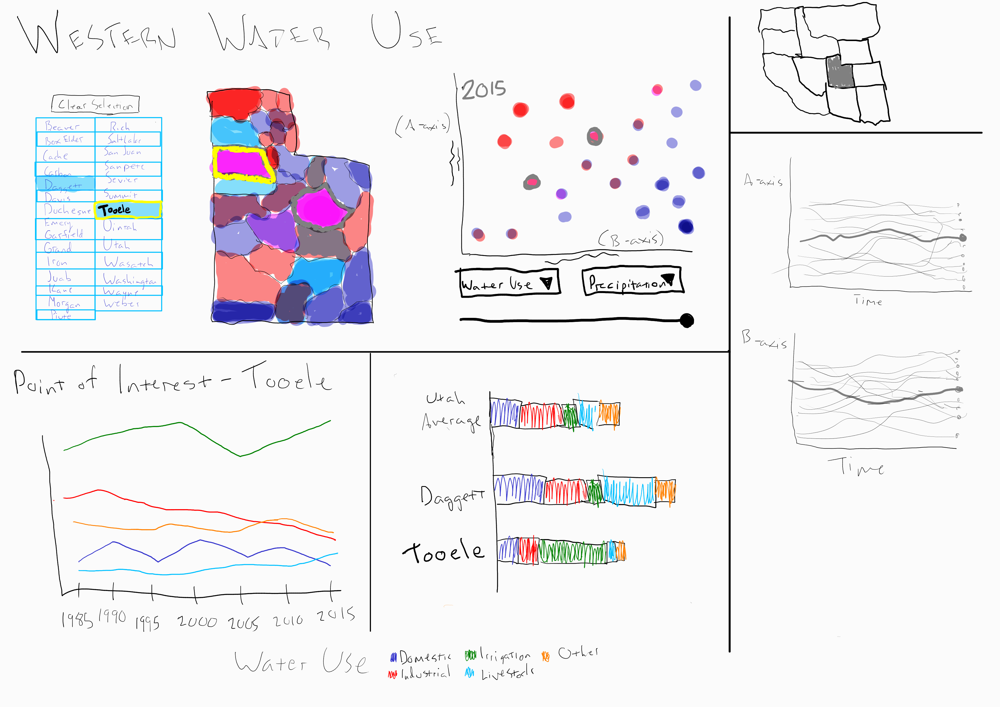

# Project Proposal

#### Names, emails, and uIDs
Name: Pranav Kiran Shah, Email: shahpranavpks@gmail.com | U1266563@utah.edu, UID:U1266563

## Background and Motivation
 * Consider any government website which provides data for Water usage; they never show visual statistics. This data is difficult to read by people. 
 * Visualizing the water consumption against a different group of data can provide us insights into the country's condition.
 * Water is an essential resource that keeps depleting, and hence, it needs to be analyzed by not just the government but also the local people.
 * Knowing how much water is consumed every year and comparing it with other facts can help devise a solution to various climate change problems.
 * Example: Comparing water usage with temperature can help us know how global warming is affecting consumption and precipitation. By knowing and understanding the data carefully, we can prevent another global crisis.
 * Therefore, this project's motivation is to spread information in a visual form that is readable and understandable by the general public.

## Project Objectives

## Data and Processing
The main data for our project comes from the USGS survey of water usage (https://waterdata.usgs.gov/ut/nwis/water_use/). This data is available for every county in the continental US every 5 years. In particular, the data for Utah is available from 1985-2015.

However, this data has considerable problems in terms of consistency. Over 250 different data categories are defined for each county, but only a small fraction of these contain data. Over time, the reporting system for counties changed and measurements that were reported in one category were changed into another. 

We will need to determine which categories should be combined, which data is not available for each county and should not be reported, and decide which of the categories are relevant for our visualization.

Country precipitation and temperature data is available for every county in the continental US at ftp://ftp.ncdc.noaa.gov/pub/data/cirs/climdiv/. This data requires no cleanup.

US County GEOJson data is available here: https://eric.clst.org/tech/usgeojson/

## Visualization Design
Data is displayed in 3 main views, all of which include multiple plots. A scatterplot with changable axis data (including precipitation, temperature, total water use, and water use by category) is on the right, with a map of counties in Utah on the left, colored by the Y/X data from the scatterplot. A slider can be used to select the year

In the time view, the data from the X-axis and Y-axis are plotted over time in two separate line plots. In the focus view, a single county can be set as the point-of-focus, which shows the change in water use categories over time.

Color is used in several ways. First, to distinguish between data points on the map (counties) and to provide some context for the plotted data (Y/X). Separate colors are also used to distinguish between each category of water use.

Having these three views allows the visualization to be flexible. A user can compare different variables in the scatter plot, as well as view how those variables have changed over time in the time view. The focus view can be used to compare different counties, or how one particular county's water use has changed.

## Features
#### Required Features
* View 1
  * Scatterplot of each county
    * All options for Both axis
      * Water Use
      * Domestic Water Use
      * Population
      * Precipitation
      * Avg Temperature 
    * Slider to select year
    * Color is set as Y/X for each county 
  * Map of Utah counties
    * Colored by Y/X
  * Buttons to select each county (since location may not be known on map)
  * Double-click buttons, map, or scatter plot to set Point-of-focus
* View 2 - Far Right 
  * Line Plot A
    * Y axis is data from variable 1
    * X axis is time 
  * Line Plot B
    * Y axis is data from variable 2
    * X axis is time 
* View 3 - Bottom Left
  * Point of interest chart shows change over time.
  * Stacked bar charts of Water Use Categories for selection and state average
* Linked view highlighting:
  * Highlight county on map using single click
  * Set point of interest on map using double click
  * Highlight dot on scatterplot
  * Highlight county lines in View 2
  * Highlight year on all counties in View 2 (from slider)
#### Optional Features
* Scatterplot size for different variables. See what works.
* Hovering on water use categories shows description of category
* Selection average shown in focus view.
* If no point of focus is selected, use average of selection
* Include preset to highlight interesting data points.
* Add US map to select state
* US View - 
  * Select a different state to load into all Views
  * Select Multiple states to bring both states into all Views

## Project Schedule
* Week 10 (Oct 25-31): Finalize working draft of design, submit project proposal
* Week 11 (Nov 1-7): 
  * Prav: Setup US view. Clicking on a state should open a new page, printing state map/name. Setup hosting. 
  * Frost: Draw state view with counties, including scatterplot. Setup data object, process data.
* Week 12 (Nov 8-14): 
  * Prav: Add line charts.
  * Frost: Add point of focus view, buttons and map selection
* Week 13 (Nov 15-21): 
  * Incorporate mentor feedback. 
  * Add linked highlighting and selection
  * Finalize visual choices (color, layout, etc)
* Week 14 (Nov 22-28): 
  * Add US view with multiple states, 
  * Add tooltip water category descriptions
* Week 15 (Nov 29): 
  * Add interesting data preset, 
  * Submit project
